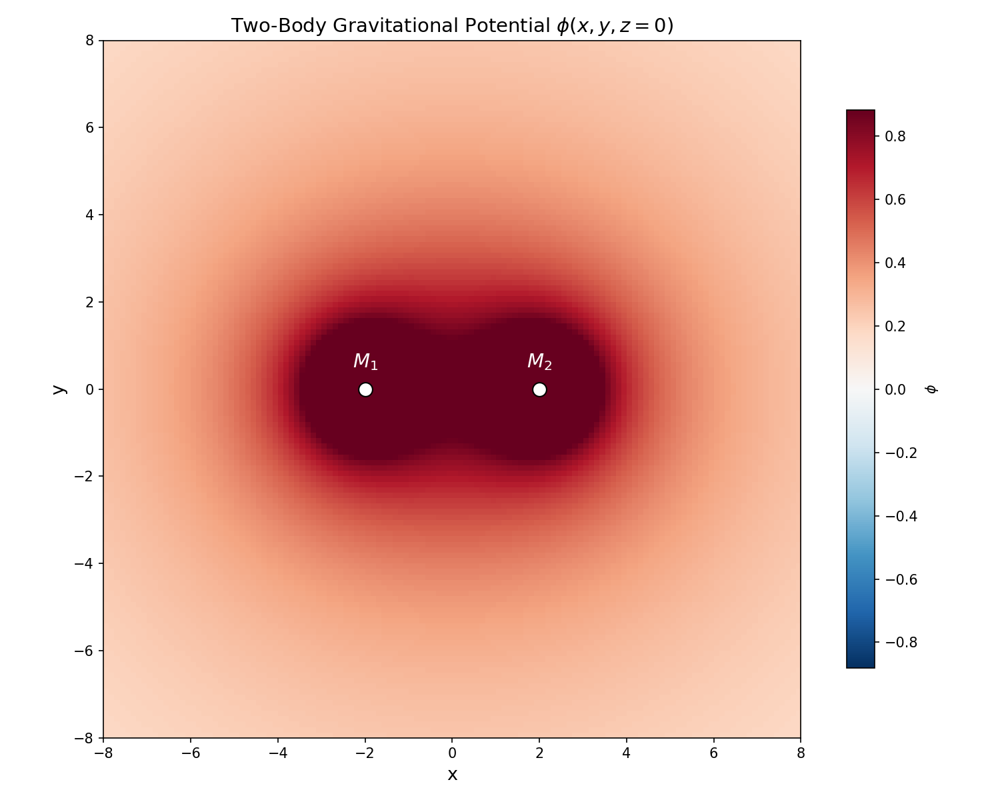

# Medium Coupling Theory (MCT)

**A mechanical framework for gravity, mass, inertia, and light as emergent phenomena of medium dynamics.**

---

## Abstract

Medium Coupling Theory (MCT) proposes that the observable universe is embedded within a dynamic, self-sustaining toroidal flow. All fundamental physical phenomena (gravity, mass, inertia, the constancy of the speed of light, entropy, and quantized particle properties) emerge from the degree and nature of coupling between localized structures and this underlying medium.

MCT does not dispute the mathematical validity of General Relativity or Quantum Mechanics. It proposes that these frameworks describe the *measurable consequences* of medium dynamics rather than the dynamics themselves. Einstein's field equations describe the accounting: the relationship between energy distribution and geometric outcome. MCT asks what mechanism produces that outcome.

For the full mathematical treatment, see the [Phase 2 formalization](formalization/mathematical-framework.md).

---

## 1. The Medium

### 1.1 Structure

The medium is modeled as a toroidal flow field exhibiting three simultaneous motions:

- **Axial translation**: the torus moves along its central axis.
- **Toroidal circulation**: rotation around the ring's central loop.
- **Poloidal circulation**: the critical motion. The medium continuously rolls through itself, outward along the exterior, inward through the core, forming a self-sustaining inside-out flow pattern.

This is the same compound motion observed in toroidal vortices (smoke rings), which are notable for their coherence, stability, and self-contained dynamics.

### 1.2 Properties

The medium has **no rest frame**. There is no stationary background against which motion can be measured. Everything (matter, energy, light) exists as structures or states within the flow. This is why Michelson-Morley found nothing and why relativity works: there is no aether to detect because the medium is not stationary. Everything *is* the flow.

The medium is the **irreducible substrate**. Asking "what is the medium made of?" may be equivalent to asking "what is existence made of?", a metaphysical question outside the scope of the theory.

The medium is **pre-geometric**. Spacetime, as described by General Relativity, is an emergent macroscopic description of the medium's flow topology, not a fundamental entity.

---

## 2. Core Postulates

### Postulate 1: Gravity is poloidal acceleration

The poloidal circulation of the medium continuously sweeps its contents inward toward the core of the toroidal cross-section. Objects embedded in the medium experience persistent acceleration toward the flow center.

By the equivalence principle (Einstein, 1907), an observer in a continuously accelerating frame cannot distinguish that acceleration from a gravitational field. MCT proposes that this equivalence is not merely formal but *literal*. Gravity is not a force, not curvature, but the direct experience of being carried by a medium in poloidal motion.

What General Relativity describes as spacetime curvature is the mathematical characterization of the poloidal flow field as measured from within, by observers who cannot perceive the medium directly.

The [Phase 2 derivation](formalization/mathematical-framework.md#2-derivation-newtonian-gravity-from-medium-flow) recovers Newton's law $\mathbf{F} = -\frac{GMm}{r^2}\hat{\mathbf{r}}$ from the medium's linear response to a coupling source. The [equivalence principle](formalization/mathematical-framework.md#3-derivation-the-equivalence-principle) is shown to be a structural identity, not an assumption.

### Postulate 2: Mass is coupling to the medium via angular momentum

Mass is not an intrinsic property of matter. It is the **degree of coupling** between a localized structure and the medium's flow.

The coupling mechanism is **angular momentum**. A structure with angular momentum creates a rotational profile that interlocks with the medium's own flow dynamics. Greater and more complex angular momentum structure produces stronger coupling and greater observed mass.

This postulate implies:

- **Massless entities** (photons) have no angular momentum coupling to the medium. They do not participate in the flow.
- **Massive particles** are rotational structures (vortex knots or eddies) whose spin creates mechanical engagement with the medium.
- **Mass is quantized** because angular momentum is quantized. Discrete spin states produce discrete coupling levels, yielding discrete mass values without requiring a separate mass-granting mechanism.
- **Different particles have different masses** because they represent different angular momentum topologies. A proton (three quarks, gluon flux tubes, complex internal angular momentum) is a tighter, more elaborate knot in the flow than an electron (simpler rotational structure). The difference is structural complexity, not kind.

See [Section 5](formalization/mathematical-framework.md#5-derivation-mass-quantization-from-angular-momentum) of the Phase 2 document for the quantization argument and the connection to the Higgs mechanism.

### Postulate 3: Inertia is resistance from medium coupling

An object at rest in the medium frame is already being accelerated by the flow. Applying an external force to change its motion requires working against the medium's grip on the object.

Inertia is therefore not a mysterious intrinsic resistance to acceleration. It is the **mechanical resistance of the medium-object coupling** to perturbation. More coupling (more angular momentum, more mass) means more resistance. This provides a direct mechanical origin for Newton's second law: $F = ma$ reflects the relationship between applied force, coupling strength, and resulting deviation from the medium's flow.

### Postulate 4: Light is the uncoupled state

Light does not travel through the medium. Light is **minimally coupled** to the medium, effectively stationary relative to it.

What we measure as the speed of light ($c$) is not the speed at which photons move. It is the **rate at which mass-coupled matter is swept away from light's rest state** by the medium. The speed of light is a separation rate, not a propagation speed.

This reframes several features of Special Relativity:

- **The speed limit $c$** is not arbitrary. Mass-coupled objects cannot outrun the medium carrying them, so the separation rate between matter and light asymptotically approaches but never exceeds $c$.
- **Lorentz invariance** emerges geometrically from the flow dynamics rather than being postulated.
- **Light has no rest mass** because "mass" means "coupled to the medium," and light, by definition, is not.

The [Phase 2 treatment](formalization/mathematical-framework.md#4-derivation-the-speed-of-light-as-separation-rate) formalizes this and derives the Lorentz transformation from the medium's finite characteristic speed.

### Postulate 5: Gravitational interaction with light is partial entrainment

In regions of extreme medium flow (near large mass concentrations), the flow intensity is sufficient to partially entrain even uncoupled light. This produces:

- **Gravitational lensing**: light paths deflected by intense local flow.
- **Gravitational redshift**: light losing energy as it climbs out of a high-flow region.
- **Black holes**: regions where the medium flow exceeds the threshold at which even uncoupled light is fully entrained and cannot escape.

The [Schwarzschild derivation](formalization/mathematical-framework.md#6-derivation-schwarzschild-metric-from-nonlinear-medium-response) recovers GR's black hole solution from the nonlinear medium response. The [black hole information section](formalization/mathematical-framework.md#11-the-black-hole-information-paradox) addresses the information paradox.

---

## 3. Phenomena Addressed

### 3.1 Entropy

In standard physics, the second law of thermodynamics is treated as a statistical axiom. MCT provides a **mechanical cause**: the medium is continuously churning. Entropy is what being stirred looks like from inside. Systems disperse not because of an abstract tendency toward disorder, but because the medium is actively dispersing them through its toroidal circulation.

See [Section 7](formalization/mathematical-framework.md#7-derivation-entropy-from-medium-dynamics) for the entropy derivation.

### 3.2 Cosmological Expansion

The poloidal flow naturally produces an expansion effect. The outer surface of the toroidal flow moves outward. Observers embedded within the medium would measure surrounding objects receding, consistent with observed cosmological expansion. Accelerating expansion may correspond to non-constant poloidal circulation rates, potentially removing the need for dark energy as a separate entity.

MCT also dissolves the cosmological constant problem (the $10^{122}$ discrepancy between predicted and observed vacuum energy). Vacuum fluctuations are symmetric medium noise with no net flow, so they do not gravitate. See [Section 10](formalization/mathematical-framework.md#10-the-cosmological-constant-problem).

### 3.3 Dark Matter

MCT provides a structural explanation: dark matter consists of topological structures in the medium with angular momentum that couples to the gravitational mode but not the electromagnetic mode. These structures would be invisible, massive, and gravitationally active, matching observations.

This explains the Bullet Cluster observation (gravitational lensing separated from visible matter) and predicts a discrete mass spectrum for dark matter particles. See [Section 12](formalization/mathematical-framework.md#12-dark-matter-from-medium-topology).

### 3.4 Cosmic Microwave Background Topology

A toroidal large-scale structure predicts that sufficiently distant observations could reveal topological signatures, such as matched circles in the CMB, suppressed large-angle correlations, and alignment of low multipoles (the "axis of evil"). Some analyses of CMB data have shown hints consistent with these predictions. See [Prediction 2](formalization/mathematical-framework.md#143-prediction-2-cmb-toroidal-topology-signatures).

### 3.5 Universal Particle Spin

Every known fundamental particle possesses intrinsic angular momentum (spin). Standard physics treats spin as an abstract quantum number with no mechanical explanation for its universality. MCT provides one: angular momentum is the coupling mechanism to the medium. A structure with zero angular momentum has zero mass and zero gravitational participation. Spin is not incidental; it is **constitutive**.

### 3.6 Quantum Mechanics

MCT derives the Schrodinger equation from the medium's micro-structure via Nelson's stochastic mechanics (1966). The medium has discrete micro-structure at the Planck scale. Coupled particles undergo Brownian motion from interactions with this micro-structure, and the resulting stochastic dynamics reproduce quantum mechanics exactly.

This dissolves the measurement problem, derives the Born rule as an equilibrium theorem, and explains the uncertainty principle as the medium's resolution limit. See [Section 9](formalization/mathematical-framework.md#9-quantum-mechanics-from-medium-micro-structure).

### 3.7 The Aharonov-Bohm Effect

The AB effect (particles affected by electromagnetic potentials in regions of zero field) is mysterious only if fields are taken as fundamental and potentials as mathematical artifacts. MCT reverses this: the electromagnetic potential $\mathbf{A}$ is the medium's actual flow state. Fields $\mathbf{E}$ and $\mathbf{B}$ are derived quantities (gradients and curls). Particles couple to the medium, not to curls of the medium.

See [Section 8](formalization/mathematical-framework.md#8-the-aharonov-bohm-effect-potentials-are-the-medium).

---

## 4. Relationship to Existing Frameworks

| Framework | MCT Interpretation |
|---|---|
| **General Relativity** | Correct mathematical description of the medium's flow field as experienced from within. The stress-energy and curvature tensors are measurements of medium dynamics, not the dynamics themselves. |
| **Special Relativity** | Lorentz invariance and the constancy of $c$ emerge from the flow geometry and the nature of light as an uncoupled state. |
| **Quantum Mechanics** | Derived from stochastic interactions with the medium's Planck-scale micro-structure. The wavefunction is a statistical description of coupling to the medium. |
| **Thermodynamics** | The second law is a consequence of medium dynamics rather than a statistical axiom. |
| **Higgs Mechanism** | The Higgs field describes the local coupling properties of the medium. Spontaneous symmetry breaking corresponds to the medium's preferred flow state. |

---

## 5. Engineering Implications

If mass is coupling to the medium, and coupling depends on how angular momentum interlocks with the medium's flow, then coupling can be modulated. This has direct consequences for propulsion and inertia control. See the full treatment in [propulsion.md](applications/propulsion.md) and [coupling-modulation.md](applications/coupling-modulation.md).

The key insight: you cannot reduce a particle's intrinsic spin (it is quantized and fixed), but you can change the *collective arrangement* of angular momenta in a bulk material. The total coupling of a macroscopic object is the vector sum of its constituents' couplings. Modifying the coherence, orientation, or topology of that collective state changes the sum.

Three near-term candidates:

**Superconducting phase transition.** Cooper pairs link two spin-1/2 electrons with opposite orientation. The pair's winding topology differs from two independent electrons, changing the collective coupling. Precision weighing of a superconductor through $T_c$ should reveal a sudden, reversible mass anomaly. Standard physics predicts exactly zero.

**Rotating superconductors.** The London moment links mechanical rotation to the condensate's angular momentum state. A spinning superconducting disc has a different coupling configuration than the same disc spinning in the normal state. This is the closest thing to a coupling "dial" that current technology can build.

**Bose-Einstein condensates.** All atoms in one quantum state form a single collective topology rather than independent couplings. Atom interferometry can measure mass ratios to parts in $10^{12}$, potentially enough to detect the coupling change.

None of these experiments require new technology. They require doing a measurement nobody has done with precision, because standard physics provides no motivation to look. MCT provides the motivation.

---

## 6. Testable Predictions

MCT makes predictions that differ from standard physics. See [Section 14](formalization/mathematical-framework.md#14-testable-predictions-unique-to-mct) for the full derivations.

| Prediction | Testable With |
|---|---|
| Gravitational Aharonov-Bohm effect | Atom interferometry |
| CMB toroidal topology signatures | CMB-S4, LiteBIRD |
| Evolving dark energy ($w \neq -1$) | DESI, Euclid, Rubin |
| Regge slope tied to $G$ | Hadron spectroscopy |
| Planck-scale decoherence rate | MAQRO, macroscopic QM experiments |
| Hubble tension from torus geometry | CMB + distance ladder cross-correlation |
| Absolute proton stability | Hyper-Kamiokande, DUNE |
| Mass anomaly at superconducting $T_c$ | Precision weighing (Kibble balance) |

The last prediction is the most immediately accessible. The equipment exists. The measurement takes days, not decades. A nonzero result would confirm that mass depends on angular momentum topology. A null result at sufficient precision would constrain MCT's coupling mechanism.

---

## 7. Roadmap

### Conceptual Framework ✅
This document. Core postulates, qualitative phenomenon mapping, relationship to existing frameworks.

### Mathematical Formalization ✅
[Complete.](formalization/mathematical-framework.md) Derives Newtonian gravity, the equivalence principle, Lorentz invariance, the Schrodinger equation, the Schwarzschild metric, and more from MCT postulates.

### Foundations ✅
[Complete.](foundations/) The [unified action principle](foundations/mct-action.md), [quantum field theory](foundations/quantum-field-theory.md) from medium dynamics, [fermion spin-statistics](foundations/fermions-and-spin-statistics.md) from topology, the [fine structure constant](foundations/fine-structure-constant.md) from compact geometry, [matter-antimatter asymmetry](foundations/matter-antimatter.md) from medium chirality, and [why 3+1 dimensions](foundations/why-3plus1.md) from vortex stability.

### Extensions (Active)
Open problems under development: [mass spectrum](extensions/mass-spectrum.md) from knot topology, [gravitational waves](extensions/gravitational-waves.md) beyond GR, [Kaluza-Klein unification](extensions/kaluza-klein.md), [nuclear forces](extensions/nuclear-forces.md) as medium modes, and [torus parameters](extensions/torus-parameters.md) from observational data.

### Applications (Active)
Engineering implications: [propulsion](applications/propulsion.md) and [coupling modulation](applications/coupling-modulation.md).

### Simulation (First Results) ✅
[Computational verification](simulation/simulation.md) of MCT's core mechanism. Topological structures (vortex ring, trefoil knot, figure-eight knot) embedded in a 3D medium produce exact $1/r$ gravitational potentials with $R^2 > 0.99998$. Two structures attract with $F \propto 1/d^2$. Newton's law emerges from medium coupling without being put in by hand.

---

## Contributing

This is an open theoretical project. Contributions in the form of mathematical formalization, critical analysis, computational modeling, and observational comparisons are welcome.

---

## License

This work is released under [CC BY-SA 4.0](https://creativecommons.org/licenses/by-sa/4.0/), free to share and adapt with attribution and same license.

---

*Medium Coupling Theory originated from independent conceptual work by Ray, developed and formalized in collaboration with Claude (Anthropic). 2025-2026.*
