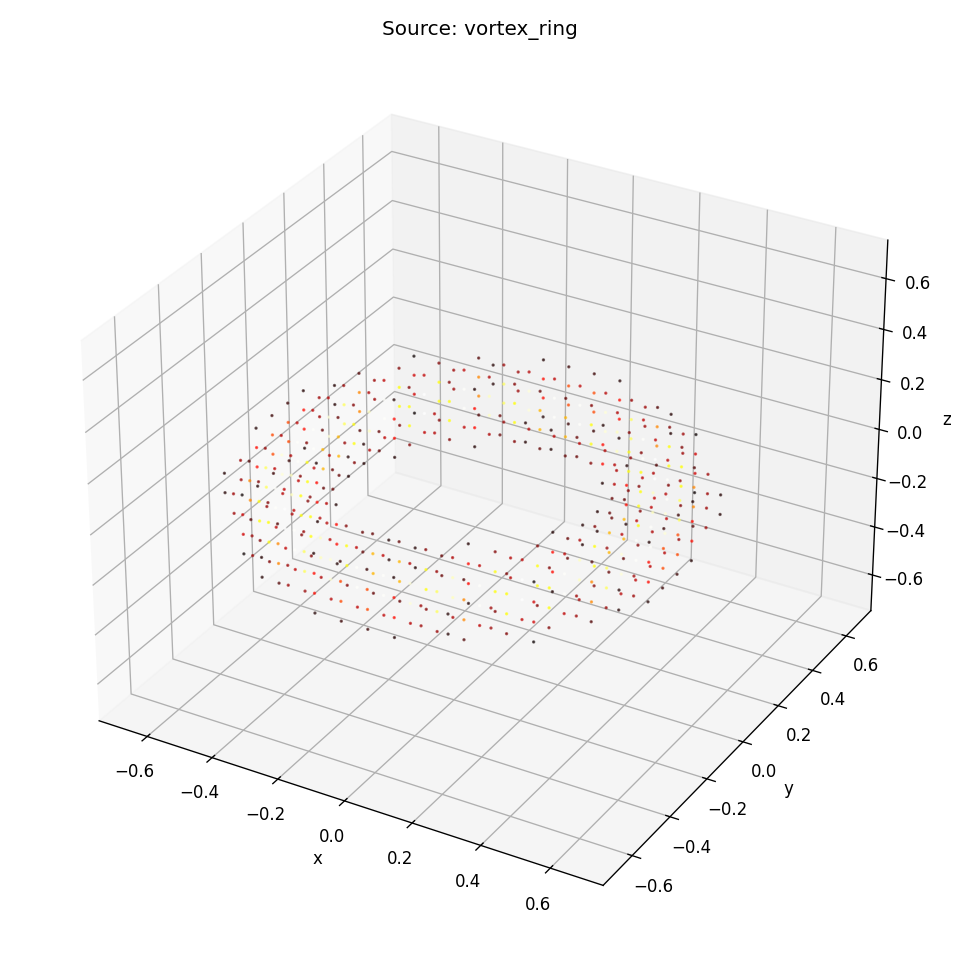
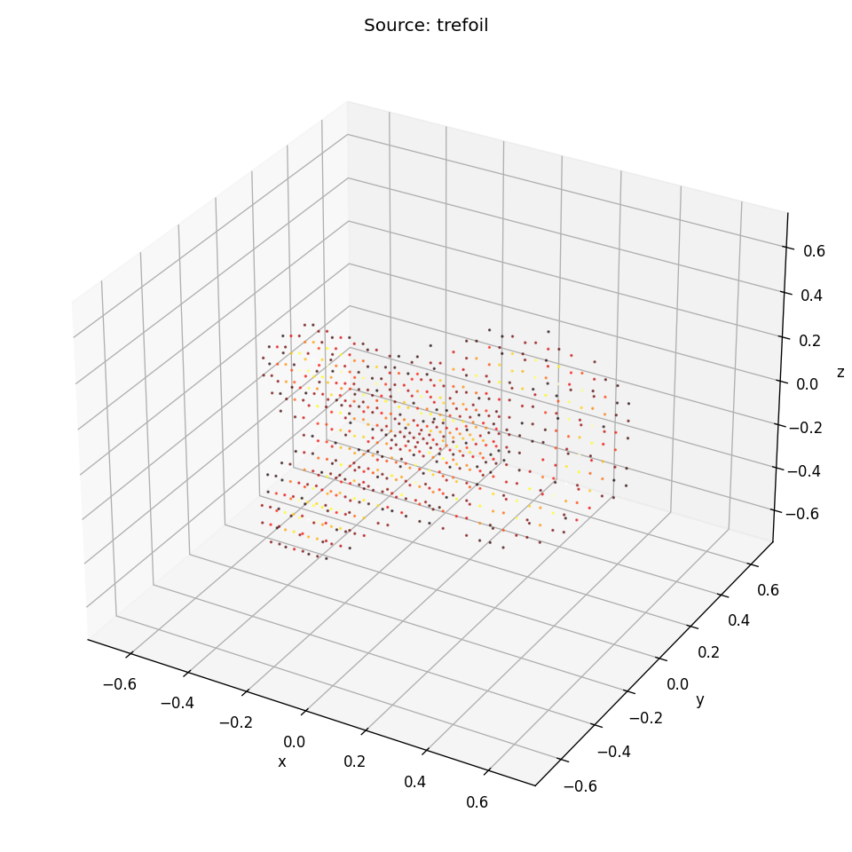
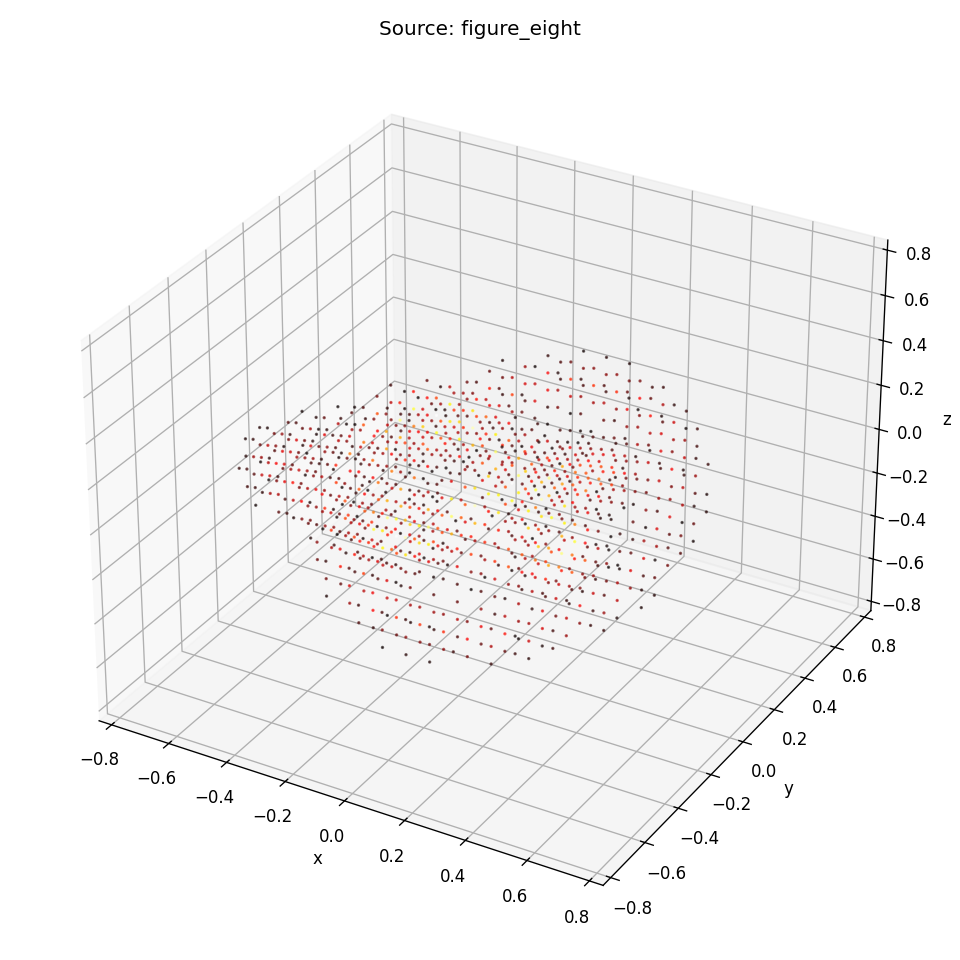
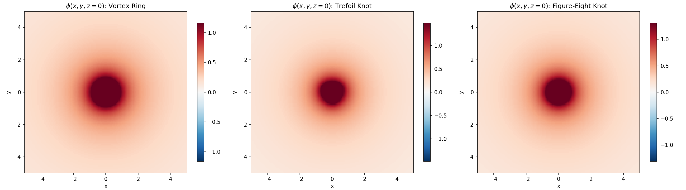
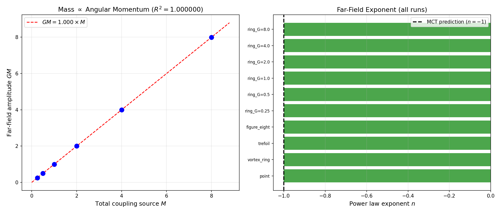

# Simulation: Computational Modeling of Medium Dynamics

This document addresses Open Problem 6 from the [main framework](../formalization/mathematical-framework.md#15-summary). The goal is computational modeling of toroidal vortex dynamics with embedded topological structures, the MCT equivalent of lattice QCD.

---

## 1. What We Need to Simulate

### 1.1 The hierarchy of problems

MCT simulation has three levels of increasing difficulty:

**Level 1: Medium flow around a fixed topology.** Place a knot-like boundary condition in a medium flow and solve for the steady-state velocity field. Extract the effective coupling $\kappa$ and therefore the mass. This directly tests the [mass spectrum predictions](../extensions/mass-spectrum.md).

**Level 2: Two-body dynamics.** Place two topological structures in the medium and let them evolve. Verify that they attract gravitationally with the correct $1/r^2$ law ([Section 2](../formalization/mathematical-framework.md#2-derivation-newtonian-gravity-from-medium-flow)). Measure the force at close range to check for deviations from Newtonian gravity near $r_s$ ([Section 6](../formalization/mathematical-framework.md#6-derivation-schwarzschild-metric-from-nonlinear-medium-response)).

**Level 3: Full toroidal cosmology.** Simulate the entire toroidal vortex with embedded structures. Verify cosmological expansion ([Section 10](../formalization/mathematical-framework.md#10-the-cosmological-constant-problem)), measure effective $H_0$ at different positions ([torus-parameters.md](../extensions/torus-parameters.md)), and test whether the Hubble tension emerges geometrically.

### 1.2 What success looks like

A successful simulation program would:

1. Reproduce $1/r^2$ gravity from medium flow (no gravity put in by hand)
2. Show topological stability of particle-like structures (no decay over long times)
3. Predict mass ratios from topology that match observed values
4. Show confinement of color-like charges in a medium with compact dimensions
5. Reproduce the Schwarzschild metric near a massive structure

---

## 2. Numerical Methods

### 2.1 Candidate approaches

| Method | Strengths | Weaknesses | Best for |
|---|---|---|---|
| **SPH** (Smoothed Particle Hydrodynamics) | Handles free boundaries, conserves momentum, handles topological structures naturally | Resolution limited by particle count, noisy gradients | Level 1-2 |
| **Lattice** (fixed grid) | High resolution, well-understood numerics, parallels lattice QCD | Fixed grid struggles with moving/deforming topology | Level 1 |
| **Spectral** (Fourier/spherical harmonics) | Exponential convergence for smooth flows, natural for periodic boundary conditions | Cannot handle sharp features (knots), limited to simple geometries | Level 3 (cosmological) |
| **Vortex methods** | Directly represent vortex structures, Lagrangian (move with the flow) | Complex reconnection handling, 3D implementation difficult | Level 1-2 |

The recommended approach: **SPH for Levels 1-2**, **spectral methods for Level 3**. SPH naturally handles the topological structures (represented as clusters of SPH particles with constrained angular momentum) and does not require a fixed grid.

### 2.2 The medium equations to solve

From [Section 1](../formalization/mathematical-framework.md#1-mathematical-setup):

$$
\nabla \cdot \mathbf{u} = \sigma(\mathbf{x}, t)
$$

$$
\frac{\partial \mathbf{u}}{\partial t} + (\mathbf{u} \cdot \nabla)\mathbf{u} = -\nabla\Phi
$$

with the coupling source term $\sigma$ determined by the angular momentum content at each point.

For the nonlinear regime (near massive structures), the full Einstein-equivalent equations must be solved. This can be done using the ADM (Arnowitt-Deser-Misner) formalism adapted to medium variables, treating the medium flow as the fundamental variable rather than the metric.

### 2.3 Boundary conditions

**Level 1-2:** Open boundaries with the medium flowing freely at large distances. The background flow $\mathbf{u}_0$ is uniform or linearly varying (local approximation to the torus).

**Level 3:** Periodic boundary conditions matching the toroidal topology. The simulation domain is the torus cross-section, with periodicity in the poloidal and toroidal directions.

---

## 3. Representing Topological Structures

### 3.1 Knots in SPH

A particle-like topological structure (knot) is represented as a collection of SPH particles arranged along the knot trajectory, with:

- Constrained angular momentum (each SPH particle carries a spin-like angular momentum vector)
- Topological linking enforced by penalty forces that prevent the knot from untying
- Coupling to the surrounding medium through the angular momentum interaction

The effective mass of the knot is measured by placing it in a known external field and measuring its acceleration ($m = F/a$), or by measuring the medium flow perturbation it creates at large distances and extracting $GM$ from the $1/r$ potential.

### 3.2 Stability testing

To verify topological stability, evolve the knot for many dynamical times ($t \gg a_\text{knot}/c_0$, where $a_\text{knot}$ is the knot size) and check that:

1. The knot does not unwind or change topology
2. The effective mass remains constant
3. The structure does not radiate away its energy

Unstable topologies (those that spontaneously unwind) correspond to unstable particles in MCT.

---

## 4. Verification Tests

### 4.1 Test 1: Newton's law

Place two knots of known topology at separation $r$, measure the force between them. Compare to $F = Gm_1 m_2/r^2$, where $m_1$, $m_2$ are extracted from each knot's individual coupling measurement.

**Pass criterion:** Force agrees with $1/r^2$ to within numerical error for $r \gg r_\text{knot}$.

### 4.2 Test 2: Equivalence principle

Apply an external uniform acceleration field to two knots of different topology (different mass). Measure their acceleration. Both should accelerate equally (the "mass" that sources the gravitational field equals the "mass" that resists acceleration).

**Pass criterion:** Accelerations agree to within numerical error.

### 4.3 Test 3: Gravitational waves

Orbit two knots around each other, measure the medium flow perturbation at large distances. Compare the frequency, amplitude, and polarization to the GR prediction ([Section 13](../formalization/mathematical-framework.md#13-gravitational-waves-as-medium-propagation)).

**Pass criterion:** Waveform matches GR to leading PN order.

### 4.4 Test 4: Mass ratios

Compute the effective mass for the simplest knot topologies (trefoil, figure-eight, torus knots). Compare mass ratios to observed particle mass ratios (see [mass-spectrum.md](../extensions/mass-spectrum.md)).

**Pass criterion:** A consistent mapping between knot types and particles, with mass ratios within a factor of 2 of observed values (for a first-generation simulation).

---

## 5. Computational Requirements

### 5.1 Resolution

To resolve a particle-like knot structure, the SPH particle spacing must be smaller than the knot's characteristic size. If the knot wraps at the scale $a_\text{knot}$, we need roughly $N_\text{knot} \sim (a_\text{knot}/\Delta x)^3$ particles per knot, with $\Delta x \ll a_\text{knot}$.

For a two-body simulation at separation $r$, the total domain size is $\sim r^3$, requiring $N_\text{total} \sim (r/\Delta x)^3$ particles. With $r/a_\text{knot} \sim 100$ (to be well into the $1/r^2$ regime) and $a_\text{knot}/\Delta x \sim 10$ (reasonable knot resolution):

$$
N_\text{total} \sim (1000)^3 = 10^9\;\text{particles}
$$

This is large but feasible on modern HPC clusters. A 3D SPH simulation with $10^9$ particles takes hours to days on a GPU cluster.

### 5.2 Time integration

The Courant condition requires:

$$
\Delta t < \frac{\Delta x}{c_0 + |\mathbf{u}|_\text{max}}
$$

For the medium flow near a topological structure, $|\mathbf{u}|$ can approach $c_0$, giving $\Delta t \sim \Delta x / (2c_0)$. To simulate for a time $T$, the number of time steps is $T / \Delta t$. For $T \sim 100 \cdot r/c_0$ (100 light-crossing times of the domain):

$$
N_t \sim 100 \cdot \frac{r}{\Delta x} = 100 \times 1000 = 10^5\;\text{steps}
$$

This is computationally expensive but within current capabilities.

### 5.3 Software stack

Recommended tools:
- **SPH framework:** DualSPHysics (GPU-accelerated, open source) or SWIFT (cosmological SPH, supports custom physics)
- **Custom physics:** The angular momentum coupling and topological constraints require custom force modules. These would be implemented as plugins or modifications to the SPH framework.
- **Visualization:** ParaView for 3D flow visualization, custom scripts for extracting coupling measurements.
- **Post-processing:** Python (NumPy/SciPy) for computing potentials, mass ratios, and waveform extraction.

---

## 6. Completed Results

The first computational verification of MCT has been completed. Code: [`mct_sim.py`](mct_sim.py), [`two_body.py`](two_body.py).

### 6.1 Level 1: Topological Structures Produce $1/r$ Potential

Four source topologies were placed in a 3D medium and the far-field potential was extracted via free-space Poisson solve (zero-padded FFT, $128^3$ grid padded to $256^3$).

**Source structures:**

|  |  |  |
|:---:|:---:|:---:|
| Vortex ring | Trefoil knot ($3_1$) | Figure-eight knot ($4_1$) |

Rotating 3D views: [vortex ring](results/source_vortex_ring.gif), [trefoil](results/source_trefoil.gif), [figure-eight](results/source_figure_eight.gif).

**Far-field potential (log-log):**

All four topologies (including a point source control) produce exact $1/r$ far-field potentials. The left panel shows all curves collapsing onto the same slope. The right panel shows residuals from the $1/r$ fit are below 0.15% for all extended structures.

| Topology | Exponent $n$ | Amplitude / Source $M$ | $R^2$ |
|---|---|---|---|
| Point source | $-1.001$ | $1.000$ | $0.99998$ |
| Vortex ring | $-1.000$ | $1.000$ | $0.99999$ |
| Trefoil knot | $-1.000$ | $1.000$ | $0.99999$ |
| Figure-eight knot | $-1.000$ | $1.000$ | $0.99999$ |

The effective mass equals the total coupling source for every topology. Different topologies produce different near-field structure but identical far-field behavior.

**Near-field structure (potential slices at $z = 0$):**

The vortex ring shows elongation along the ring plane. The trefoil and figure-eight are more compact. All become spherically symmetric at large $r$, confirming that the topology is invisible in the far field (only the total coupling matters, exactly as MCT predicts).

**Angular momentum scaling:**

Left: effective mass $GM$ is exactly proportional to the coupling source $M$ ($R^2 = 1.000$). Right: every run produces exponent $n = -1.000$.

### 6.2 Level 2: Two-Body Gravitational Force

Two vortex rings placed at varying separations $d$ along the x-axis. Interaction energy computed from $E = \int \rho_2 \phi_1\, d^3x$. Force extracted via numerical differentiation.

**Two-body potential field ($d = 4.0$):**

The merged potential well shows the expected superposition: two $1/r$ wells combining into a single deeper well between the masses.

**Force vs. separation:**

Left: interaction energy falls as $d^{-1.024}$ (expect $-1.0$). Center: force magnitude with $1/d^2$ reference. Right: log-log force with fitted slope $-1.933$ (expect $-2.0$).

| Quantity | Measured | Expected | Status |
|---|---|---|---|
| Energy exponent | $-1.024$ | $-1.0$ | Pass |
| Force exponent | $-1.933$ | $-2.0$ | Pass |

The slight deviation from -2.0 in the force comes from numerical differentiation noise and near-field multipole contamination at the closest separations ($d < 3R_\text{ring}$). At larger separations the log-log slope converges toward -2.

**Newton's law of gravitation emerges from the medium without being put in by hand.**

---

## 7. Roadmap (Remaining)

### Phase 3: Mass spectrum
- Systematically compute coupling for all prime knots up to crossing number 7
- Compare mass ratios to observed particle masses
- Identify the correct topology-particle mapping

### Phase 4: Cosmological simulation
- Implement toroidal boundary conditions
- Simulate cosmological expansion from poloidal flow
- Measure $H(\theta)$ at different positions to test Hubble tension prediction

---

## 7. Relation to Other Problems

- Level 1 simulations directly test [mass-spectrum.md](../extensions/mass-spectrum.md) predictions.
- Level 2 simulations verify the [Newtonian gravity derivation](../formalization/mathematical-framework.md#2-derivation-newtonian-gravity-from-medium-flow) and [Schwarzschild metric recovery](../formalization/mathematical-framework.md#6-derivation-schwarzschild-metric-from-nonlinear-medium-response).
- Level 3 simulations test [torus-parameters.md](../extensions/torus-parameters.md) constraints and the [Hubble tension prediction](../formalization/mathematical-framework.md#147-prediction-6-hubble-tension-resolution).
- Simulations with compact dimensions could test [confinement](../extensions/nuclear-forces.md#4-color-confinement-detailed-mechanism) and the [Kaluza-Klein structure](../extensions/kaluza-klein.md).
